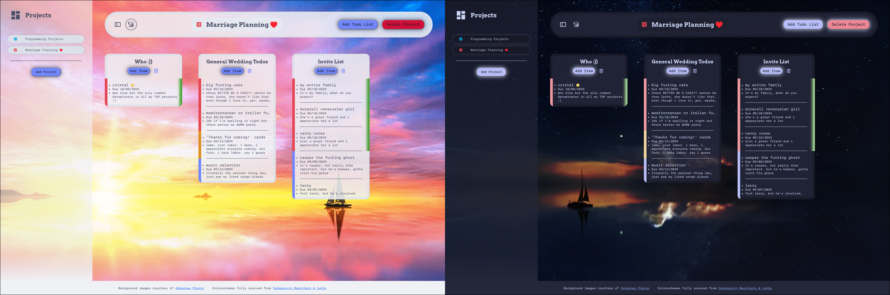

# Todo List Project (not mobile compat)

I couldn't bother with mobile compatability especially after the scope of this project exceeding what I genuinely was hoping for.

I had a lot of fun, it was 100% my most challenging project to date. **Don't go out of scope like I did, just do what's required and dip.** I made a whole fucking kanban board instead of just a simple todo list.

### Credits
- [Johannes Plenio](https://unsplash.com/@jplenio) for the images
- [Catppuccin Color Scheme](https://catppuccin.com/)
- Courtesy of [The Odin Project](https://www.theodinproject.com), Project Todo List.
